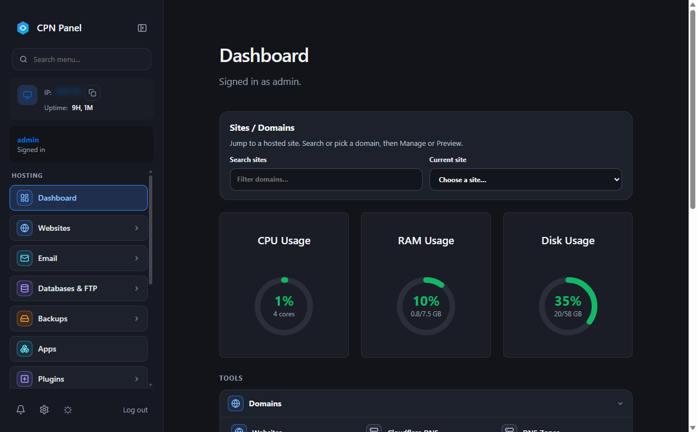
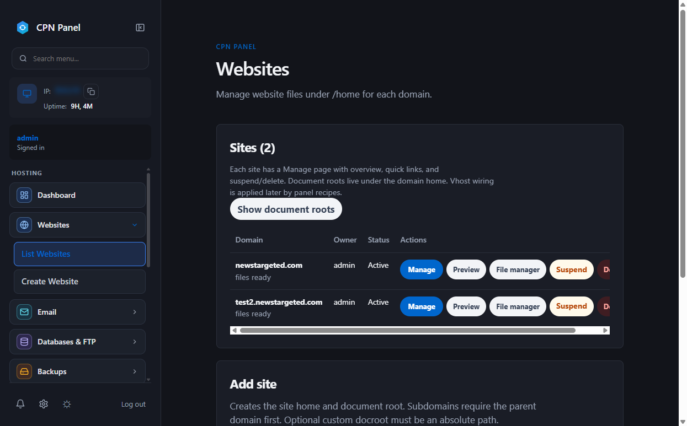
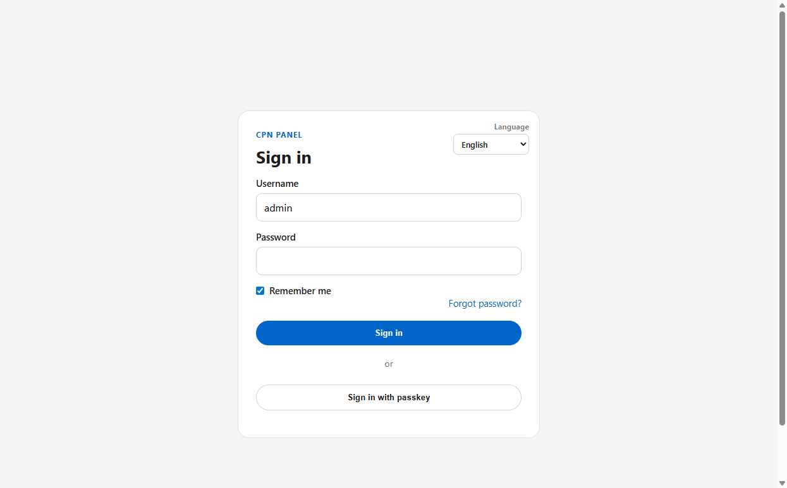

# CPN · Control Panel Network

> [!WARNING]
> **Alpha only** (published tip **v0.2.6-alpha.21**; line **0.2.6-alpha.22**). No stable 1.x yet. Prefer a disposable VPS or VM, keep backups, and read [Platform Support](docs/SUPPORT.md) before important hosts.

[](https://github.com/Control-Panel-Network/CPN-Control-Panel-Network/actions/workflows/ci.yml)
[](LICENSE)

**CPN** (Control Panel Network) is a Rust web installer and hosting control panel from [News Targeted](https://newstargeted.com), with contributions and support from [Discord Bot Network](https://discord-bot-network.com). Install on AlmaLinux, Rocky, RHEL, Ubuntu, or Debian; manage sites, mail, databases, SSL, and more from the panel. Windows Server has a limited Phase A path.

<p align="center">
  
</p>

<p align="center">
  
  &nbsp;
  
</p>

## Install

On a supported Linux guest (the script requests `sudo` automatically when needed):

```bash
curl -fsSL https://cpn.newstargeted.com/install.sh | bash
```

If the host is down, use GitHub raw:

```bash
curl -fsSL https://raw.githubusercontent.com/Control-Panel-Network/CPN-Control-Panel-Network/stable/scripts/install.sh | bash
```

Then start the installer:

```bash
sudo cpn-installer          # interactive Web or SSH/CLI
sudo cpn-installer --web    # browser UI (default 127.0.0.1:2087)
sudo cpn-installer --cli    # terminal wizard
```

SSH tunnel for remote hosts: `ssh -L 2087:127.0.0.1:2087 root@your-server`, then open the URL printed by `--web`.

Pins (`-b` / `--ref`), wget hosts, `--bypass`, env vars, and retag notes: **[docs/INSTALL.md](docs/INSTALL.md)**.

## Upgrade

```bash
curl -fsSL https://cpn.newstargeted.com/upgrade.sh | bash
```

Pin tip (example):

```bash
curl -fsSL https://cpn.newstargeted.com/upgrade.sh | bash -s -- -b v0.2.6-alpha.43
```

After the package upgrade, `upgrade.sh` auto-runs `cpn-installer --upgrade` when a panel install is detected. Full options: [docs/INSTALL.md](docs/INSTALL.md).

## Uninstall

```bash
sudo cpn-installer --uninstall --yes
# or: sudo cpn uninstall --yes
```

Default removes the panel package and `/var/lib/cpn`, and keeps website files under `/home/<domain>` plus host MariaDB/OLS. Details: [docs/CLI.md](docs/CLI.md).

## After install

```bash
cpn --help
cpn panel url
sudo cpn password            # reset an account password from the terminal
```

## Docs

Host landing + script mirror: **[https://cpn.newstargeted.com/](https://cpn.newstargeted.com/)** (source `site/`, deploy notes [docs/HOST-SITE.md](docs/HOST-SITE.md)).

All guides: **[docs/](https://github.com/Control-Panel-Network/CPN-Control-Panel-Network/tree/stable/docs)**

| Doc | Topic |
| --- | --- |
| [INSTALL.md](docs/INSTALL.md) | One-liners, pins, fallbacks, `--bypass` |
| [SUPPORT.md](docs/SUPPORT.md) | Supported / partial / refused OS |
| [CLI.md](docs/CLI.md) | `cpn` and `cpn-installer` flags |
| [RELEASES.md](docs/RELEASES.md) | Packages, checksums, GPG |
| [CHANGELOG.md](docs/CHANGELOG.md) | Release history |
| [CONTRIBUTING.md](CONTRIBUTING.md) | Builds and PRs |
| [SECURITY.md](SECURITY.md) | Vulnerability reporting |

## License

Copyright (C) 2026 CPN contributors.

Distributed under the [GNU General Public License version 3](LICENSE) (`GPL-3.0-only`).
